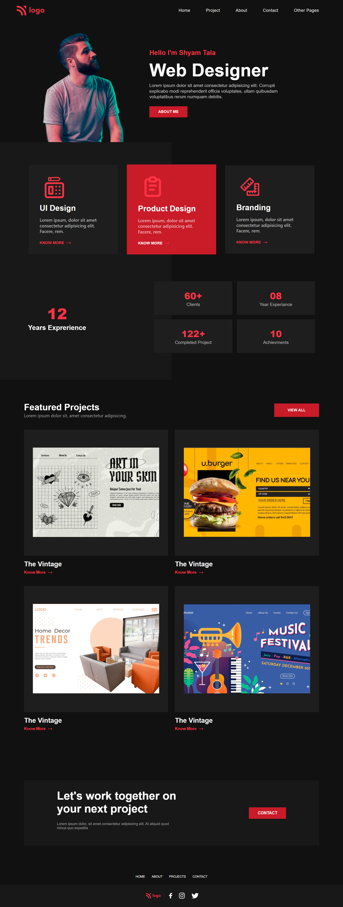

# Project-15 HTML  and CSS 

## Hi, I'm Shyam Tala! 👋

## Screenshots

>I Deployed my Site on Netlify and Vercel. so you can check it out 👇
  [https://portfolio-zippy.netlify.app](https://portfolio-zippy.netlify.app)
  [https://assignment-15.vercel.app/](https://assignment-15.vercel.app/)

## What I Learned from this Project?

 
- I learned about flex-box and grid layout
- I learned about how can i fixed element at fixed position
- I learned about how i can modfyies the scrollbar
- this project create little big color sence also.  
- learn about how to make site responsive using media query and stuff

## This Project took around 03:00 Hours to complate.

## Author

- [@shyamtala](https://github.com/shyamtala003)
